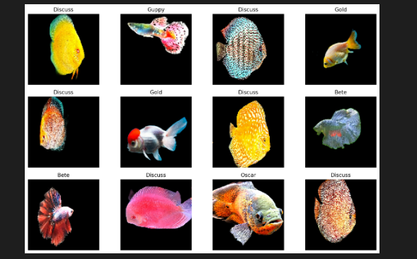
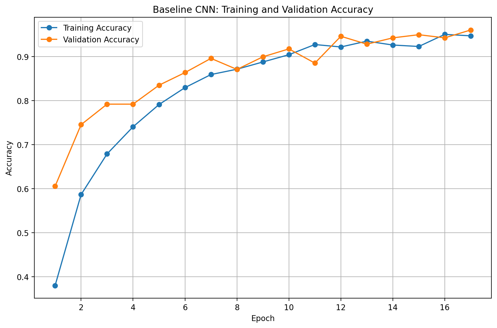
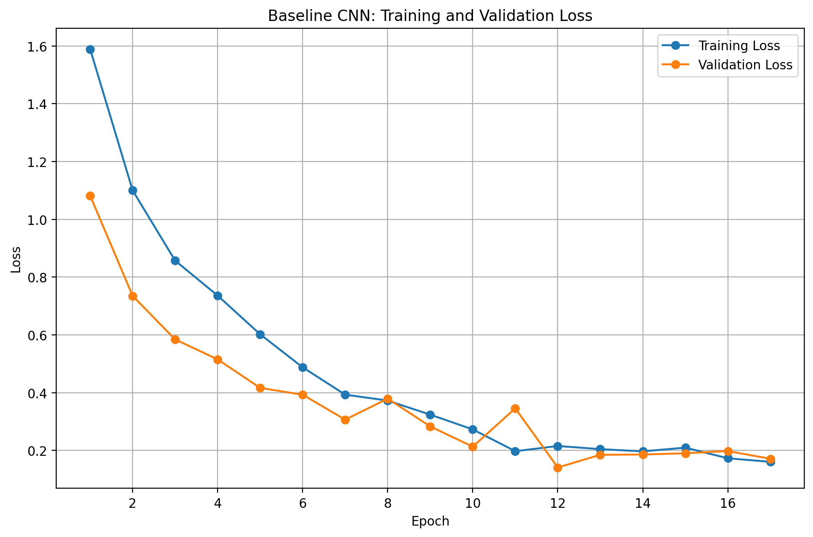
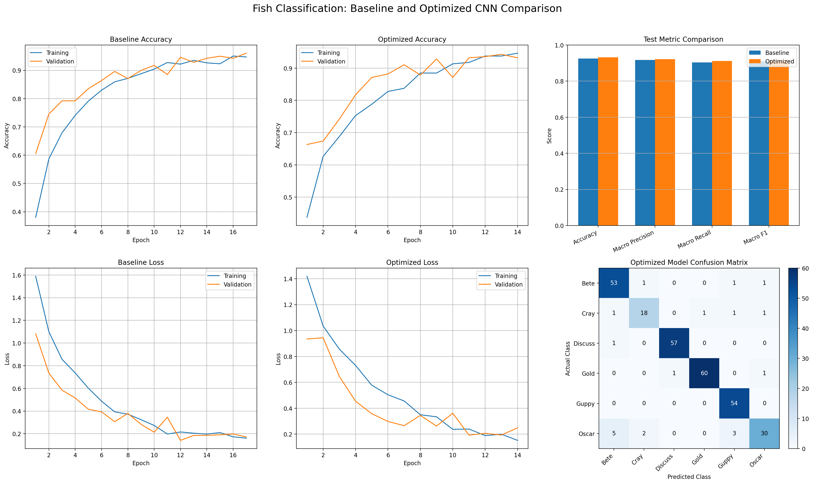

# Ijeoma Nwosu CS898BA Project Homework one

## Project Overview

This project performs visual statistics and image processing analysis on a doorbell-camera image. It includes histogram equalization, Gaussian blur, edge detection, and segmentation techniques to improve object visibility and separate foreground elements.

## Visual Statistics

- The histogram shows that most pixel values are in darker intensity regions, indicating underexposure.
- The distribution is non-uniform and consistent with nighttime imagery.
- Skewness values confirm the bias toward darker pixels.

## Histogram Equalization

- Equalizing the V channel in HSV greatly improves visibility of the foreground figure and surrounding structures.
- This enhancement is achieved without significantly altering color information.

## Gaussian Blur Analysis

- Increasing the Gaussian sigma reduces noise and fine details.
- Higher sigma values produce smoother images at the expense of edge sharpness.
- Lower sigma values preserve edges while still reducing some noise.

## Edge Detection Comparison

### Sobel

- Accurate directional edge information
- Moderately sensitive to noise

### Laplacian

- Captures many edges
- Can generate noisy outputs in dark images

### Prewitt

- Computationally simple
- Less accurate edge localization

### Canny

- Best balance between edge detection and noise reduction
- Produces the most distinct outline for the figure

## Edge Detection Conclusion

Canny edge detection performed best on this doorbell-camera image because non-maximum suppression and hysteresis thresholding produced cleaner object boundaries and fewer false edges than the other methods.

## Notes

- The project is focused on enhancing image visibility and evaluating different edge detection and segmentation approaches.
- Results are stored in the `src/images/` folders.

## Homework Two – Image Segmentation

### CS 898BA – Image Analysis and Computer Vision

---

 **Project Overview**
This assignment extends Homework One by applying image segmentation techniques to isolate a foreground figure captured in a low-light doorbell camera image.

The objective is to extract the unknown figure from the background using multiple segmentation approaches and evaluate their effectiveness both visually and quantitatively.

This project combines:

- Image preprocessing
- Color normalization
- Threshold-based segmentation
- Optimization-based segmentation
- Quantitative segmentation evaluation
- Visualization and comparison

---

## Objective

The goal of this project is to isolate the central figure from a dark outdoor scene and compare segmentation methods for accuracy and robustness.

The following segmentation techniques were implemented:

1. Multi-channel Color Normalization
2. Otsu  Thresholding
3. Adaptive  Thresholding
4. K-Means Clustering
5. Quantitative evaluation using IoU and Dice Coefficient

---

## Repository Structure

```text
src/
├── hw1/
│   ├── conversions.py
│   ├── image_stats.py
│   ├── affine_transformations.py
│   ├── gaussian_blur.py
│   ├── edge_detection.py
│   ├── create_plots.py
│   └── config.py
├── hw2/
│   ├── normalize.py
│   ├── threshold_segmentation.py
│   ├── kmeans_segmentation.py
│   ├── metrics.py
│   ├── create_segmentation_plot.py
│   └── config.py
├── images/
│   ├── original/
│   ├── converted/
│   ├── transformed/
│   ├── blurred/
│   ├── edges/
│   ├── plots/
│   └── segmentation/
├── AI_Log.md
└── libraries.txt
```

---

## Installation

## Clone Repository

```bash
git clone <(https://github.com/INWOSU123/IjeomaNwosu-CS898BA-Project1/)>
```

Open project:

```bash
cd IjeomaNwosu-CS898BA-Project1
```

---

## Dependencies

Install required packages:

```bash
pip install opencv-python numpy scipy matplotlib pandas
```

Verify installation:

```bash
python -c "import cv2,numpy,matplotlib"
```

---

## Image Dataset

Input Image:

images/original/HW1_IMG_CS898BA.png

The image is a low-light outdoor scene containing a possible Alien figure.

Challenges:

- Uneven lighting
- Dark shadows
- Background clutter
- Weak object boundaries

---

## Part 1 — Multi-Channel Color Normalization

## Method

To standardize illumination across the image:

1. Load original RGB image
2. Split channels:
   - Red
   - Green
   - Blue
3. Apply Histogram Equalization independently
4. Merge channels

Output:

normalized_rgb.png

## Purpose

Improve:

- Contrast
- Visibility
- Segmentation consistency

---

## Part 2 — Threshold Segmentation

 Otsu Thresholding

### Process

1. Convert normalized image to grayscale
2. Compute automatic threshold
3. Separate foreground/background

Output:

otsu_mask.png
otsu_segment.png

### Advantages (Otsu Thresholding)

- Fast
- Automatic threshold selection
- Simple implementation

### Disadvantages (Otsu Thresholding)

- Sensitive to noise

---

 Adaptive Thresholding

1. Convert normalized image to grayscale
2. Compute local thresholds

Output:

adaptive_mask.png
adaptive_segment.png

### Advantages (Adaptive Thresholding)

- Handles uneven lighting
- Better local segmentation

### Disadvantages (Adaptive Thresholding)

- Increased noise
- Fragmented regions

---

## Part 3 — K-Means Segmentation

### K-Means Method

Steps:

1. Convert normalized image to HSV
2. Reshape pixels
3. Apply K-Means clustering
4. Test K values

Values tested:

K = 3
K = 4
K = 5

Selected:

K = 4

Output:

kmeans_mask.png
kmeans_segment.png

### Advantages (K-Means Segmentation)

- Uses color information
- Better separation

### Disadvantages

- Requires parameter tuning
- Cluster selection required

---

## Part 4 — Quantitative Evaluation

## Ground Truth Creation

A manual reference mask was created:

reference_mask.png

White:
Foreground Figure

Black:
Background

---

## Metrics

### Intersection over Union (IoU)

Formula:

IoU = |A ∩ B| / |A ∪ B|

Measures overlap between prediction and reference.

---

### Dice Coefficient

Formula:

Dice = 2|A ∩ B| / (|A| + |B|)

Measures segmentation similarity.

---

## Results

| Method | IoU | Dice |

| Otsu | 0.045120915586633274 | 0.08634582834141562|
| Adaptive | 0.0714083490967658 | 0.13329810087249275 |
| K-Means | 0.02965334410815843 | 0.05759869431365346 |

---

## Visual Comparison

Generated using:

```powershell
cd src
python hw2/create_segmentation_plot.py
```

Output:

images/segmentation/comparison/final_plot.png

Displayed:

1. Original
2. Normalized
3. Otsu
4. Adaptive
5. K-Means

## Analysis

## Effect of Color Normalization

Applying histogram equalization across all color channels improved contrast and reduced lighting inconsistencies.

Compared with Homework One:

- Figure visibility improved
- Segmentation boundaries became more distinguishable
- Thresholding produced more stable masks

---

## Segmentation Comparison

### Otsu

Produced clean global segmentation but struggled in darker regions.

### Adaptive

Captured local detail but introduced more background noise.

### K-Means

Produced the strongest separation because clustering considered color information instead of intensity only.

---

## Conclusion

This assignment demonstrated that segmentation performance improves significantly when image preprocessing is applied before segmentation.

Among the evaluated methods:

- Otsu provided fast baseline segmentation
- Adaptive improved local illumination handling
- K-Means achieved the strongest figure isolation

Combining classical image processing with segmentation techniques produced measurable improvements over raw-image analysis.

---

## Running the Project

Execute in order:

```powershell
cd src
python hw2/normalize.py
python hw2/threshold_segmentation.py
python hw2/kmeans_segmentation.py
python hw2/metrics.py
python hw2/create_segmentation_plot.py
```

---

## AI Usage

All AI assistance used for this assignment was documented in:

AI_Log.md

## Homework Three: Deep Learning for Fish Classification

Overview

Homework Three extends the image processing techniques developed in Homework One and the image segmentation methods implemented in Homework Two by introducing deep learning for multi-class image classification. The objective of this assignment was to design, train, optimize, and evaluate a custom Convolutional Neural Network (CNN) capable of classifying six different fish species. Unlike transfer learning approaches, this project was completed using a CNN built entirely from scratch in TensorFlow/Keras to satisfy the course requirement prohibiting pretrained models.

The completed pipeline includes dataset preparation, image preprocessing, data augmentation, baseline CNN development, systematic hyperparameter optimization, quantitative performance evaluation, and qualitative analysis.

## Data Preprocessing

Every image was standardized before training to ensure consistent input dimensions and improve learning efficiency.

The preprocessing pipeline consisted of:

Image resizing to 128 × 128 pixels
Pixel normalization to the range [0,1]
Automatic batching
Efficient data loading using TensorFlow datasets

Normalizing the pixel values prevented large numerical variations during optimization and accelerated convergence during training.

## Data Augmentation

To improve generalization and reduce overfitting, data augmentation was applied only to the training dataset.

The augmentation pipeline included:

Random horizontal flipping
Small random rotations
Random brightness adjustments

Validation and testing images were intentionally left unchanged to ensure that performance metrics reflected the model's ability to generalize to unseen data.

The augmentation strategy exposed the CNN to a larger variety of image appearances without changing the underlying fish species.

## Baseline CNN Training

The baseline CNN was trained using the following hyperparameters.

Hyperparameter  Value
Optimizer Adam
Learning Rate 0.001
Batch Size 32
Dropout 0.30
Maximum Epochs 20

Early stopping and model checkpointing were incorporated to prevent unnecessary training once validation performance stopped improving.

The baseline model achieved stable convergence and demonstrated strong learning throughout training.

## Baseline Training Analysis

The baseline training curves show a consistent increase in both training and validation accuracy throughout the training process.

Training accuracy increased from 38.02% during the first epoch to 94.73% by the final epoch.

Validation accuracy increased from 60.57% to 96.06%, demonstrating that the CNN rapidly learned discriminative image features.

Similarly, both the training and validation loss curves steadily decreased throughout training, indicating stable optimization.

The validation loss reached its lowest values near the later training epochs and remained close to the training loss. The small gap between the two curves demonstrates that the network generalized well to unseen validation images.

The learning curves show no evidence of severe overfitting. Training accuracy and validation accuracy remained closely aligned, while both loss curves followed similar downward trends.

The slightly higher validation accuracy is expected because data augmentation was applied only to the training images, making the training samples more challenging than the validation images.

Hyperparameter Optimization

A systematic grid search was performed to identify the optimal combination of hyperparameters.

The search evaluated three learning rates, two batch sizes, and two dropout rates, resulting in twelve different experiments.

## Hyperparameter Search Space

| Hyperparameter | Values Tested |
| :--- | :--- |
| **Learning Rate** | 0.01, 0.001, 0.0001 |
| **Batch Size** | 32, 64 |
| **Dropout** | 0.30, 0.50 |

Each experiment trained a completely new CNN initialized with random weights.

The model achieving the lowest validation loss was selected as the optimized model.

Best Hyperparameters

The optimal configuration was:

## Best Hyperparameters

The optimal configuration was:

| Hyperparameter | Best Value |
| :--- | :--- |
| **Learning Rate** | 0.001 |
| **Batch Size** | 32 |
| **Dropout** | 0.30 |
| **Best Epoch** | 11 |
| **Validation Accuracy** | 94.27% |
| **Minimum Validation Loss** | 0.1925 |

The selected learning rate of 0.001 produced stable optimization without oscillation.

The batch size of 32 enabled frequent parameter updates that improved convergence.

A dropout rate of 0.30 provided sufficient regularization while maintaining the network's learning capacity.

Hyperparameter Search Discussion

The hyperparameter search demonstrates that moderate optimization settings produced the strongest performance.

Experiments using a learning rate of 0.01 converged rapidly but produced substantially higher validation loss, indicating unstable optimization.

Experiments using a learning rate of 0.0001 learned more slowly and did not achieve the same validation performance within the allotted training epochs.

Batch size 32 consistently outperformed batch size 64, suggesting that more frequent parameter updates improved generalization.

Increasing dropout from 0.30 to 0.50 reduced model capacity and slightly decreased validation performance.

Experiment 5 produced the lowest validation loss and was therefore selected as the final optimized model.

## Final Model Performance

The optimized CNN achieved the highest overall performance.

## Baseline vs Optimized Model

| Metric | Baseline | Optimized |
| :--- | :---: | :---: |
| **Test Accuracy** | 92.47% | 93.15% |
| **Precision** | 91.70% | 92.19% |
| **Recall** | 90.33% | 91.09% |
| **F1-Score** | 90.91% | 91.45% |

The optimized CNN improved every evaluation metric over the baseline model, demonstrating that systematic hyperparameter tuning enhanced overall generalization performance.

Classification Report Discussion

The optimized CNN classified six fish species with high overall accuracy.

The Discuss class achieved the strongest performance with an F1-score of 98.28%, indicating that this species possessed highly distinctive visual features.

The Gold and Guppy classes also achieved excellent classification performance with F1-scores exceeding 95%.

The Guppy class achieved 100% recall, demonstrating that every Guppy image in the testing dataset was correctly identified.

The Oscar class produced the lowest F1-score (82.19%) and the lowest recall (75%). These results indicate that Oscar images shared visual similarities with several other fish species, making them more difficult for the CNN to distinguish.

The Cray class also produced lower performance than the remaining species, suggesting additional visual overlap with neighboring classes.

## Confusion Matrix Analysis

The confusion matrix demonstrates strong classification performance across the six fish species.

Most predictions lie along the main diagonal, indicating that the majority of fish images were correctly classified.

The largest source of classification error involved the Oscar class.

Out of forty Oscar test images:

30 were correctly classified as Oscar.
5 were incorrectly classified as Bete.
3 were incorrectly classified as Guppy.
2 were incorrectly classified as Cray.

These errors indicate that Oscar shares several visual characteristics with these species.

The Guppy class exhibited perfect recall, correctly classifying every Guppy image in the testing dataset.

The Discuss and Gold classes also demonstrated excellent separability, producing only isolated classification errors.

## Overall Discussion

The completed fish classification pipeline successfully demonstrates the effectiveness of a custom CNN trained entirely from scratch.

Image preprocessing standardized the dataset, while data augmentation increased variability in the training images and reduced the likelihood of overfitting.

The baseline CNN established a strong starting point for classification, and systematic hyperparameter optimization further improved performance.

The optimized model achieved 93.15% classification accuracy, correctly classifying the overwhelming majority of test images.

The strongest classification performance occurred for the Discuss, Gold, and Guppy classes because these species possess distinctive visual characteristics.

Most classification errors involved the Oscar class, whose appearance overlaps more closely with other fish species.

The combination of preprocessing, augmentation, dropout regularization, early stopping, and hyperparameter optimization produced a robust CNN capable of accurately classifying six fish species without relying on pretrained models.


Baseline Accuracy Curve

Baseline Loss Curve

Final Comparison Grid

